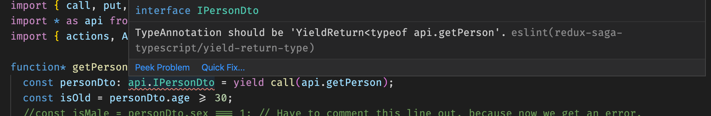

>**After I wrote this, I discovered (typed-redux-saga)[https://github.com/agiledigital/typed-redux-saga] which uses some even 
more clever TypeScript tricks and accomplishes exactly what I was looking for. I have been using this for some time now, and it works
like a charm. Kudos to @agiledigital.**

# Typesafe API calls from a Redux Saga generator function

Using TypeScript with [Redux Saga](https://redux-saga.js.org/) is a big pain, because it is not possible to have typesafe generator functions. Even though version 3.6 adds some improvements, the [problem with sagas is not solved](https://github.com/microsoft/TypeScript/issues/2983#issuecomment-230414026).

I have come up with a workaround, that works for me. Read on if this have your interest.

> In the following text, I'm showing you a simplified version of how my code i structured. A lot of details
> that are irrelevant here have been left out

## My original code - Take Zero

I have some functions I use to make API calls to my backend which look like this.

```typescript
export const getPerson = async (): Promise<IPersonDto> => {
  return await backend.get("/api/person");
};
```

The DTO returned in the example is very simple.

```typescript
export interface IPersonDto {
  id: number;
  name: string;
  age: number;
}
```

I call these functions from a saga generator function.

```typescript
function* getPerson() {
  const personDto = yield call(api.getPerson);
  const isMale = personDto.sex === 1; // This property doesn't exist on IPersonDto, but no error.
  const isOld = personDto.age >= 30 || isMale;
  yield put(actions.getPersonSuccess(personDto, isOld));
}
```

The variable `personDto` can't be inferred by TypeScript and is of type `any`. I'm using af property called `sex` which doesn't exist on the type, so it is always `undefined` but when you look at the code you would think that `isOld` is affected by the persons sex (I know this is a silly example).

Also if the shape of the DTO is changed in the future, I won't get a build error and when I type my code I don't get any intellisense help.

This is of course not good.

## An easy solution - Take One

Ok, so `personDto` is not the correct type. An easy solution is to just help TypeScript a bit.

```typescript
function* getPerson() {
  const personDto: api.IPersonDto = yield call(api.getPerson);
  const isOld = personDto.age >= 30;
  //const isMale = personDto.sex === 1; // Have to comment this line out, because now we get an error.
  yield put(actions.getPersonSuccess(personDto, isOld));
}
```

The difference is that now I'm telling TypeScript that `personDto` is of type `IPersonDto`. That gives me intellisense and as long as the return value of `api.getPerson` doesn't change - and I got it right in the first place - everything is fine.

But in the real world things do change and if the actual value returned doesn't match with what I have told TypeScript, I get no build error, but maybe a runtime error or odd behavior at some time.

This is better than the original code, but not benefitting from TypeScripts potential.

## A much better solution - Take Two

Do you know `ReturnType<T>` in TypeScript? If you have a function, you can define a type that matches the type that is returned by the function, but you don't have to know exactly which type that is.

Let's look at an example.

```typescript
type FooResult { id: number, name: string }
function foo(): FooResult {
  return { id: 42, name: "John Doe" };
}
function  bar(fooresult: FooResult) { /* */ }
```

Using `ReturnType` we can write `bar` like this:

```typescript
function bar(fooresult: ReturnType<typeof foo>) {
  /* */
}
```

How is this useful? Well, the problem in Take One was that we had to give the exact type that was returned by the API function. And we could get that wrong or it could change in the future.

So wouldn't i be nice if we could use `RetunrType` instead? Something like this:

```typescript
const personDto: ReturnType<typeof api.getPerson> = yield call(api.getPerson);
```

Unfortunately we can't do it like that. We need a bit more TypeScript magic, but we will come to that in a minute.

I'm still manually specifying the type, so why is this better? Well, it is easy to see if have got it right in the first place, because the generic parameter should match the name of the function I'm calling. And what will happen if the type returned by `api.getPerson` changes, for instance if the `age` property is renamed? Now I will get a build error.

But I said that it didn't work, so what is missing.

The problem is that I'm not really interested in the return type of `api.getPerson` because it is an `async` function that return a `Promise`. Actually a `Promise<T>` and it is the `T` that I want.

Fortunately TypeScript has at lot of advanced type related functions, and we can write a little helper to do the trick and extract the generic typeargument from the return type.

```typescript
type R<T> = T extends Promise<infer U> ? U : T;
export type YieldReturn<T> = R<ReturnType<T extends (...args: any) => any ? T : any>>;
```

With this we can write our saga like this.

```typescript
const personDto: YieldReturn<typeof api.getPerson> = yield call(api.getPerson);
```

## But I can still make errors

Yes even though it is much more easy to spot errors, it is still possible to specify a wrong type. I can still specify `IPersonDto`, but if I (or somebody else) review my code, maybe this mistake will be spotted.

**ESLINT to the rescue**

I have written an ESLINT rule that can verify that I use the right type when I `yield call` in my saga. It finds the first argument which is the function to call, and verifies that I have defined its return type as the type of my variable.

It looks like this in the VS Code editor.



## Conclusion

The ESLINT rule is til work in progress, but I expect to also include a fixer, so it will be able to fix my mistakes for me.

To me this solution is almost as good as if the functionality was native in TypeScript. I hope you find it useful.

The source code for Take Zero to Take Two and the code for the ESLINT rule can be found in this repository.
